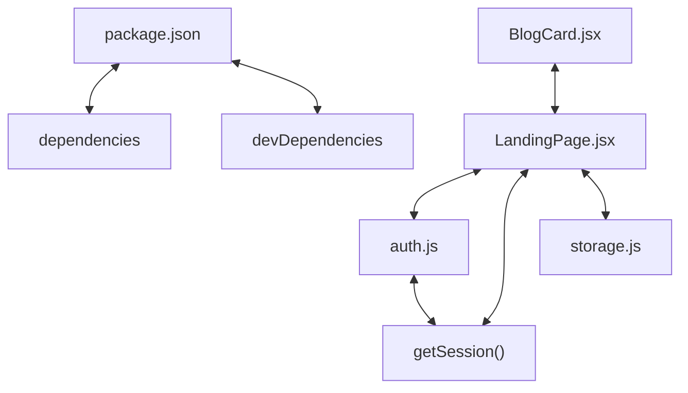

# Codebase Architectural Report

> **Auto-generated** by graphify knowledge graph analysis  
> **Purpose**: Dependency map, connection analysis, subsystem breakdown, and quality hotspots.

---

## 1. Executive Summary

- **Total Components**: `92`
- **Total Connections**: `118`
- **Subsystem Modules**: `1`
- **Dependency Types**: `4`

**Key Architectural Hubs:**

| # | Component | File | Type | Connections |
|---|-----------|------|------|-------------|
| 1 | `devDependencies` | `frontend/package.json` | function | 11 |
| 2 | `getSession()` | `frontend/src/utils/auth.js` | method | 10 |
| 3 | `LandingPage.jsx` | `frontend/src/pages/LandingPage.jsx` | class | 9 |
| 4 | `auth.js` | `frontend/src/utils/auth.js` | file | 9 |
| 5 | `package.json` | `frontend/package.json` | function | 7 |
| 6 | `BlogCard.jsx` | `frontend/src/components/BlogCard.jsx` | class | 7 |
| 7 | `storage.js` | `frontend/src/utils/storage.js` | file | 7 |
| 8 | `dependencies` | `frontend/package.json` | function | 6 |

---

## 2. Dependency & Connection Analysis

### Relationship Types

| Relationship | Count | Share |
|-------------|-------|-------|
| `contains` | 48 | 41% |
| `imports` | 41 | 35% |
| `imports_from` | 18 | 15% |
| `calls` | 11 | 9% |

### Hub Dependency Diagram

### Most Connected Pairs

| Component A | Component B | Shared Connections |
|-------------|-------------|-------------------|
| `dependencies` | `package.json` | 1 |
| `devDependencies` | `package.json` | 1 |
| `name` | `package.json` | 1 |
| `package.json` | `private` | 1 |
| `package.json` | `scripts` | 1 |
| `package.json` | `type` | 1 |
| `package.json` | `version` | 1 |
| `build` | `scripts` | 1 |
| `dev` | `scripts` | 1 |
| `scripts` | `test` | 1 |

---

## 3. Subsystem & Module Breakdown

### 3.1 frontend/package.json
**Nodes**: `92`  
**Files**: `frontend/e2e/discovery.spec.js`, `frontend/index.html`, `frontend/package.json`, `frontend/playwright.config.js`, `frontend/postcss.config.js`, `frontend/src/App.jsx` +20 more

| Component | Type | File | Connections |
|-----------|------|------|-------------|
| `devDependencies` | function | `frontend/package.json` | 11 |
| `getSession()` | method | `frontend/src/utils/auth.js` | 10 |
| `LandingPage.jsx` | class | `frontend/src/pages/LandingPage.jsx` | 9 |
| `auth.js` | file | `frontend/src/utils/auth.js` | 9 |
| `package.json` | function | `frontend/package.json` | 7 |
| `BlogCard.jsx` | class | `frontend/src/components/BlogCard.jsx` | 7 |
| `storage.js` | file | `frontend/src/utils/storage.js` | 7 |
| `dependencies` | function | `frontend/package.json` | 6 |
| `App.jsx` | class | `frontend/src/App.jsx` | 6 |
| `Navbar.jsx` | class | `frontend/src/components/Navbar.jsx` | 6 |

---

## 4. API Reference

Public classes and functions by subsystem.

### frontend/package.json

| Name | Type | File | Connections |
|------|------|------|-------------|
| `devDependencies` | function | `frontend/package.json` | 11 |
| `LandingPage.jsx` | class | `frontend/src/pages/LandingPage.jsx` | 9 |
| `package.json` | function | `frontend/package.json` | 7 |
| `BlogCard.jsx` | class | `frontend/src/components/BlogCard.jsx` | 7 |
| `dependencies` | function | `frontend/package.json` | 6 |
| `App.jsx` | class | `frontend/src/App.jsx` | 6 |
| `Navbar.jsx` | class | `frontend/src/components/Navbar.jsx` | 6 |
| `PublicNavbar.jsx` | class | `frontend/src/components/PublicNavbar.jsx` | 6 |

---

## 5. Code Quality & Architectural Risk Hotspots

### Component Type Distribution

| Type | Count | Share |
|------|-------|-------|
| function | 44 | 48% |
| class | 25 | 27% |
| method | 12 | 13% |
| file | 11 | 12% |

### Dependency Cycles

**41** circular dependency loop(s) detected:

| # | Cycle Path |
|---|-----------|
| 1 | `frontend_src_utils_storage → frontend_src_utils_storage_saveusers → frontend_src_utils_storage_test` |
| 2 | `frontend_src_utils_storage → frontend_src_utils_storage_saveposts → frontend_src_utils_storage_test` |
| 3 | `frontend_src_utils_storage → frontend_src_utils_storage_getusers → frontend_src_utils_storage_test` |
| 4 | `frontend_src_utils_storage → frontend_src_utils_storage_read → frontend_src_utils_storage_getusers` |
| 5 | `frontend_src_utils_storage_getposts → frontend_src_utils_storage_read → frontend_src_utils_storage_getusers → frontend_src_utils_storage_test` |
| 6 | `frontend_src_utils_storage → frontend_src_utils_storage_getposts → frontend_src_utils_storage_test` |
| 7 | `frontend_src_pages_landingpage → frontend_src_pages_landingpage_landingpage → frontend_src_utils_storage_getposts` |
| 8 | `frontend_src_pages_landingpage → frontend_src_pages_landingpage_test → frontend_src_pages_landingpage_landingpage` |
| 9 | `frontend_src_pages_landingpage → frontend_src_utils_auth_getsession → frontend_src_pages_landingpage_landingpage` |
| 10 | `frontend_src_utils_auth → frontend_src_utils_auth_test → frontend_src_utils_auth_getsession` |

### Orphaned Components

**11** isolated node(s) with no connections:

| Component | File |
|-----------|------|
| `discovery.spec.js` | `frontend/e2e/discovery.spec.js` |
| `playwright.config.js` | `frontend/playwright.config.js` |
| `postcss.config.js` | `frontend/postcss.config.js` |
| `setup.js` | `frontend/src/test/setup.js` |
| `tailwind.config.js` | `frontend/tailwind.config.js` |
| `vite.config.js` | `frontend/vite.config.js` |
| `Discovery Feature Work` | `todos.yaml` |
| `Identity Feature Work` | `todos.yaml` |
| `Writing Feature Work` | `todos.yaml` |
| `Administration Feature Work` | `todos.yaml` |

---

## 6. How to Navigate

1. **Interactive D3 Map** — open `graph.html` to explore node connections visually.
2. **Knowledge Graph Queries** — use MCP tools (`graph_query`, `graph_explain_node`, `graph_impact_radius`).
